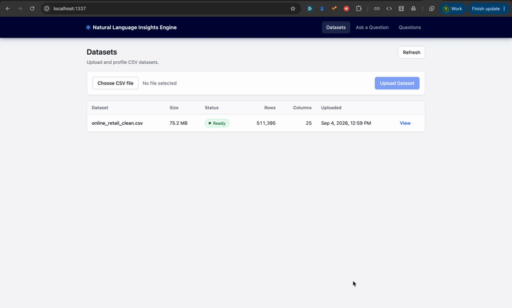
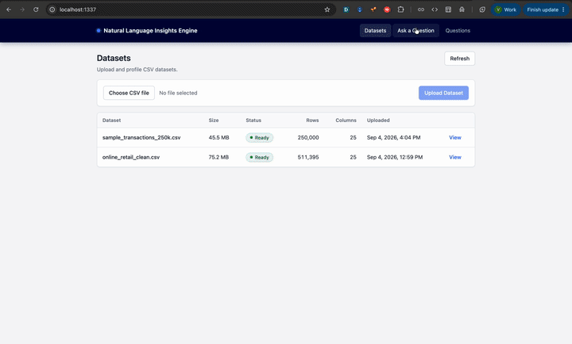

# Natural Language Insights Engine

Upload a CSV and ask analytical questions in plain English. The app infers schema
from the file, generates SQL via an LLM, validates it with a read-only guardrail,
executes it with DuckDB, and returns a summarized answer.

For system design (components, data flow, trade-offs), see **[docs/ARCHITECTURE.md](docs/ARCHITECTURE.md)**.

## Prerequisites

**Docker (recommended):** Docker and Docker Compose only.

**Host development:** Node.js 20+, npm, and Docker (for PostgreSQL and Ollama).

## Stack

- **Backend:** Node.js, TypeScript, Sails
- **Frontend:** React, Vite, TypeScript
- **Data:** PostgreSQL (metadata + job queue), DuckDB (CSV profiling and queries)
- **LLM:** OpenAI or Ollama (local)
- **Infra:** Docker Compose

## Demo

**Upload and profile a CSV** (UCI Online Retail → Ready):



**Ask a question and view the answer** (natural language → SQL → summary):



## How to run it

### Quick start (Docker)

```bash
docker compose up --build
```

Open **[http://localhost:1337](http://localhost:1337)**. First boot may take a few minutes while the local LLM model is downloaded.

Stop: `docker compose down`

### Development (host)

Requires Node.js and npm. Start only the backing services in Docker:

```bash
docker compose up -d postgres ollama
npm run setup
cp backend/.env.example backend/.env
docker compose exec ollama ollama pull qwen2.5-coder:1.5b   # once, if using local LLM
npm run dev:backend    # http://localhost:1337
npm run dev:frontend   # http://localhost:5173
```

Stop infra: `docker compose down`

Run tests: `npm test`

## How to configure it

**Docker:** copy `.env.example` to `.env` in the repo root.

**Host dev:** use `backend/.env` (see `backend/.env.example`).


| Variable         | Purpose                             | Default              |
| ---------------- | ----------------------------------- | -------------------- |
| `LLM_PROVIDER`   | `local` (Ollama) or `openai`        | `local`              |
| `OPENAI_API_KEY` | Required when `LLM_PROVIDER=openai` | —                    |
| `OPENAI_MODEL`   | Hosted model                        | `gpt-4o-mini`        |
| `OLLAMA_MODEL`   | Local model                         | `qwen2.5-coder:1.5b` |


Dataset upload works without an API key; answering questions requires a configured LLM.

Use **LLM** in the header to switch between local Ollama and OpenAI at runtime (paste an API key for OpenAI). Settings apply immediately without restarting Docker.

## How to ask it a question

### UI

1. Open **[http://localhost:1337](http://localhost:1337)**
2. Upload a `.csv` file (up to 200 MB) and wait until the dataset status is **READY**
3. Select the dataset, type a question (e.g. *What are the top 10 products by revenue?*), and submit
4. Wait until the answer appears (the UI polls automatically)


### API

```bash
# 1. Upload a CSV — returns 202 with dataset id
curl -F "file=@data.csv;type=text/csv" http://localhost:1337/api/datasets

# 2. Poll until status is READY
curl http://localhost:1337/api/datasets/<dataset-id>

# 3. Ask a question — returns 202 with question id
curl -X POST http://localhost:1337/api/questions \
  -H 'Content-Type: application/json' \
  -d '{"datasetId":"<dataset-id>","question":"What is the total revenue by country?"}'

# 4. Poll until status is ANSWERED, REFUSED, or FAILED
curl http://localhost:1337/api/questions/<question-id>
```

`REFUSED` means the question cannot be answered from the data or was blocked by the
SQL guardrail — that is a normal outcome, not a system error.