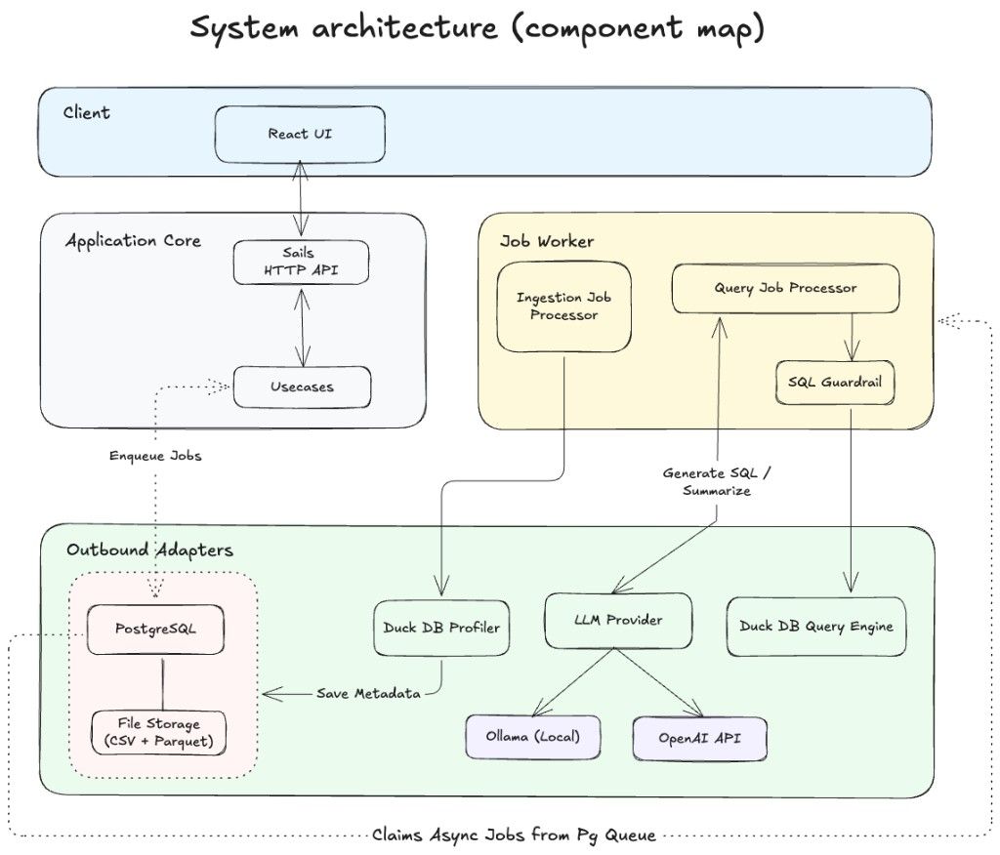

# System design

## Architecture overview

## Components and ownership

| Component               | Owns                                                                 |
| ----------------------- | -------------------------------------------------------------------- |
| **React UI**            | Upload CSV, list datasets, ask questions, poll status, show answers  |
| **HTTP API (Sails)**    | Validation, HTTP status codes, DTO mapping — no business logic       |
| **Use cases**           | Orchestration: store files, persist records, enqueue jobs            |
| **Job worker**          | Poll queue, run processors, retries, stale-job recovery              |
| **Ingestion processor** | CSV profiling job → dataset `READY` or `FAILED`                      |
| **Query processor**     | NL question → LLM SQL → guardrail → DuckDB → summary                 |
| **SQL guardrail**       | Allow only read-only `SELECT`/`WITH`; block writes, DDL, file access |
| **PostgreSQL**          | Datasets, questions, jobs; job queue (`FOR UPDATE SKIP LOCKED`)      |
| **File storage**        | `original.csv` + materialized `data.parquet` per dataset             |
| **DuckDB profiler**     | Schema inference, column statistics, Parquet write at ingest         |
| **DuckDB query engine** | Execute guardrail-approved SQL over the `dataset` view               |
| **LLM provider**        | Text-to-SQL and result summarization (OpenAI or Ollama)              |

Backend code is organized by feature (`dataset`, `question`) using **Ports &
Adapters** — business logic depends on interfaces; HTTP, Postgres, DuckDB, and
LLM are swappable adapters.

## Question path (input → answer)

1. **UI** sends `POST /api/questions` with `datasetId` and question text.
2. **API** saves the question as `PROCESSING` and enqueues a `QUERY` job in PostgreSQL.
3. **API** returns `202 Accepted` immediately with question and job ids.
4. **UI** polls `GET /api/questions/:id` until a terminal status.
5. **Worker** claims the job from the queue.
6. **Query processor** loads **dataset metadata** (inferred schema + row count) from PostgreSQL.
7. **LLM** receives the question + schema → returns SQL, or refuses if unanswerable.
8. **Guardrail** validates the SQL (single read-only `SELECT`/`WITH` only). Rejection → `REFUSED`.
9. **DuckDB** runs the SQL against the stored file (Parquet if present, else CSV).
10. **LLM** summarizes the result rows (not model memory).
11. **Processor** saves `ANSWERED` with SQL, rows, summary, and token usage.
12. **UI** poll returns the final answer.

**Grounding:** The summary is generated only from DuckDB result rows. If the LLM
refuses or the guardrail rejects the SQL, the job completes as `REFUSED` (not retried).

## Schema context from an unfamiliar file

Nothing about any sample dataset is hardcoded in prompts, SQL, or config.

**At ingestion:**

1. DuckDB `read_csv_auto` reads the uploaded CSV and infers column names and types.
2. The **profiler** computes statistics (nulls, distinct counts, min/max, samples, warnings).
3. Metadata is stored as JSON on the dataset row.
4. A **Parquet** copy is written for faster repeated queries.

**At query time**, the LLM prompt receives only:

- table name: `dataset`
- row count
- column names and inferred types

The model must write SQL that works against whatever schema was inferred — this supports loading an unseen CSV with no code changes.

### Where this breaks

| Limitation                  | Effect                                                                  |
| --------------------------- | ----------------------------------------------------------------------- |
| Ambiguous column names      | Model may misread semantics (e.g. revenue vs `Quantity * UnitPrice`)    |
| Dirty or mixed-type columns | Inference yields `unknown`; SQL may fail or be wrong                    |
| Very wide files             | All columns go into the prompt; token limits may truncate context       |
| No semantic layer           | Business terms must be guessed from column names alone                  |
| Complex analytics           | Window functions, market-basket, cohort questions may produce wrong SQL |
| Guardrail scope             | Blocks unsafe SQL but cannot prove semantic correctness                 |

Mitigations: rich profiling metadata, `REFUSED` as a first-class outcome, read-only
SQL guardrail, and **Vitest** unit tests for the SQL guardrail (deterministic CI).

## Key decisions (and alternatives rejected)

### 1. PostgreSQL job queue (not Redis / BullMQ / SQS)

**Chosen:** Jobs table with `FOR UPDATE SKIP LOCKED` for claiming.

**Why:** One dependency for persistence and queuing; transactional enqueue with
dataset/question rows; multiple workers without extra infra.

**Rejected:** In-memory queue (lost on restart), Redis/BullMQ/SQS (extra infra for a local demo).

### 2. DuckDB for analytics (not loading CSV into PostgreSQL)

**Chosen:** DuckDB reads CSV/Parquet at query time; profiler materializes Parquet on ingest.

**Why:** Fast columnar analytics on large files without migrating rows into Postgres.

**Rejected:** Postgres-only SQL (heavier ingest), in-process pandas (second runtime).

### 3. LLM generates SQL; app executes it (not direct LLM answers)

**Chosen:** Text-to-SQL with schema context, then deterministic DuckDB execution.

**Why:** Answers grounded in real data; SQL is inspectable and guardrail-enforceable.

**Rejected:** LLM answers without execution (invents numbers), row embedding (does not scale).

### 4. Ports & Adapters by feature (not fat controllers)

**Chosen:** `application/` (domain, ports, use cases) separate from `adapters/` (HTTP, DB, DuckDB, LLM).

**Why:** Clear boundaries for extensibility; swap LLM or storage without touching HTTP.

**Rejected:** Monolithic MVC with inline SQL (hard to test and extend).

## What I would build next (in order)

1. **Dedicated queue** — BullMQ or AWS SQS (DLQs, back-pressure, metrics).
2. **Worker scaling** — multiple worker replicas (split process already supported).
3. **Follow-up questions** — conversation thread per dataset with token budgeting.
4. **Cost dashboard** — aggregate per-question token and cost usage.
5. **Multi-model routing** — fast vs accurate models behind `LlmProvider`.
6. **Semantic layer** — user-defined metrics on top of inferred schema.

Also deferred: Authentication, Cloud deployment, Dataset deletion, API pagination.